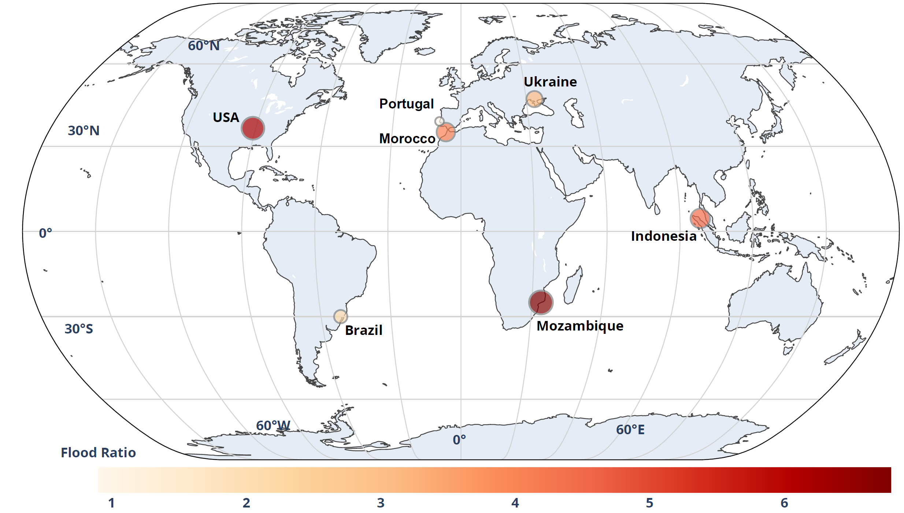

<h1 align="center">SAFE-Net: Flood mapping from SAR imagery with a shift-attention and frequency-gated vision transformer</h1>

<div>
    <h4 align="center">
    <a href='https://scholar.google.com/citations?hl=en&user=KAmm5ZkAAAAJ&view_op=list_works&sortby=pubdate' target='_blank'>Tamer Saleh</a><sup>1,2</sup>&emsp;
    <a href='https://scholar.google.com/citations?user=SAUCVsEAAAAJ&hl=en' target='_blank'>Gui-Song Xia</a><sup>✉1</sup>&emsp;
    <a href='https://scholar.google.com/citations?user=-aVL-UQAAAAJ&hl=en' target='_blank'>Wen Yang</a><sup>✉1</sup>&emsp;
    <a href='' target='_blank'>Mohamed Ihmeida</a><sup>3</sup>&emsp;
    <a href=''>Zhuohong Li</a><sup>4</sup>&emsp;
    <a href='https://scholar.google.com/citations?user=WKKVqDgAAAAJ&hl=en' target='_blank'>Shimaa Holail</a><sup>1</sup>&emsp;
    </h4>
</div>

<div>
    <h4 align="center">
    <sup>1</sup>Wuhan University&emsp;
    <sup>2</sup>Benha University&emsp;
    <sup>3</sup>Birmingham City University&emsp;
    <sup>4</sup>Duke University&emsp;
    </h4>

</div>
    <p align='center'>
        If you find our work or benchmark helpful for your research, please consider giving us a ⭐!
    </p>

## 🔥 News

  
- `2026/05/21`: The official files of the environment preparation are now available.


## Requirements

Before using this repository, make sure you have the following prerequisites installed:

- [Anaconda](https://www.anaconda.com/download/)
- [PyTorch](https://pytorch.org)

> torch==2.6.0
  torchaudio==2.6.0
  torchvision==0.21.0

Tested using Python 3.9.0 on a 64-bit Windows operating system.
```bash
conda install pytorch torchvision pytorch-cuda=12.4 -c pytorch -c nvidia
```

### Installation

To get started, create the [conda](https://docs.conda.io/projects/conda/en/stable/) environment named `SAFE-FD` by executing the following command:
```bash
conda create -n SAFE_FD python=3.9.0 -y
```

Then activate the environment:
```bash
conda activate SAFE_FD
```

## Supported Datasets

Download the datasets and place them in the `Benchmark` folder.

Dataset | Name | Link
:-:|:-:|:-:
Ombria-Net | `OmbriaS1` | [source](https://ieeexplore.ieee.org/document/9723593)
DAM-Net | `S1GFloods` | [source](https://www.sciencedirect.com/science/article/pii/S0924271624002168)
New-Dataset | `S1GFloods+7` | [baidu drive](https://pan.baidu.com/s/1SkFGxfFIf7nDIIbDI4Zlrg?pwd=i8tm#)


### :point_right: 📒 Folder Structure

  Prepare the following folders to organize this repo:

      SAR_Flood_Detection
          ├── SAFENet (code)
          ├── PRETRAINED (pvt_v2_b2.pth)
          ├── WORK_DIR (save the model weights and training logs)
          │   └─ checkpoints (the best models)
          │   └─ test_metrics (the best test results)
          │              ├─test_metrics.txt (the best test results)
          │   └─ test_visualizations
          │   └─ train_history (train & val results per epoch)
          │   └─ val_results
          └── Benchmark
              ├── OmbriaS1
              │   ├── train
              │   │   ├── A                           Images of Time 1 before the flood event
              │   │   │   └── S1_0001.png
              │   │   ├── B                           Images of Time 2 after the flood event
              │   │   │   └── S1_0001.png
              │   │   └── GT                          Ground truth labels
              │   │       └── S1_0001.png
              │   ├── test (the same with train)
              │  
              ├── SIGFloods
              │   ├── train
              │   │   ├── A
              │   │   │   └── S1_1.png
              │   │   ├── B
              │   │   │   └── S1_1.png
              │   │   └── GT
              │   │       └── S1_1.png
              │   ├── test (the same with train)
              │  
              ├── SIGFloods+7
              │   ├── train
              │   │   ├── A
              │   │   │   └── Brazil_0_1.png
              │   │   │   └── Indonesia_0_1.png
              │   │   │   └── Morocco_0_1.png
              │   │   │   └── Mozambique_0_1.png
              │   │   │   └── Portugal_0_1.png
              │   │   │   └── Ukraine_0_1.png
              │   │   │   └── USA_0_1.png
              │   │   ├── B
              │   │   │   └── Brazil_0_1.png
              │   │   │   └── Indonesia_0_1.png
              │   │   │   └── Morocco_0_1.png
              │   │   │   └── Mozambique_0_1.png
              │   │   │   └── Portugal_0_1.png
              │   │   │   └── Ukraine_0_1.png
              │   │   │   └── USA_0_1.png
              │   │   └── GT
              │   │       └── Brazil_0_1.png
              │   │   │   └── Indonesia_0_1.png
              │   │   │   └── Morocco_0_1.png
              │   │   │   └── Mozambique_0_1.png
              │   │   │   └── Portugal_0_1.png
              │   │   │   └── Ukraine_0_1.png
              │   │   │   └── USA_0_1.png
              │   ├── test (the same with train)


## Method


> We propose a shifted attention frequency-gated network (SAFE-Net) for flood detection from bi-temporal SAR image pairs.


### 🔭 Supported SOTA <a name="baselines"></a>

Method | Name | Link
:-:|:-:|:-:
:open_book:	:open_book:	 :open_book: DBF-Net | `DBF-Net` | [Paper here](https://ieeexplore.ieee.org/document/10848167)
:open_book:	:open_book:	 :open_book: WBA-Net | `WBA-Net` | [Paper here](https://ieeexplore.ieee.org/document/10605827)
:open_book:	:open_book:	 :open_book: GLA-Former | `GLA-Former` | [Paper here](https://ieeexplore.ieee.org/document/10766648)
:open_book:	:open_book:	 :open_book: CAS-Net | `CAS-Net` | [Paper here ](https://ieeexplore.ieee.org/document/10504920)
:open_book:	:open_book:	 :open_book: PA-Former | `PA-Former` | [Paper here](https://ieeexplore.ieee.org/document/9863867)
:open_book:	:open_book:	 :open_book: ViCxLSTM | `ViCxLSTM` | [Paper here](https://www.sciencedirect.com/science/article/pii/S1569843225004480)
:open_book:	:open_book:	 :open_book: BiSR-Net | `BiSR-Net` | [Paper here](https://ieeexplore.ieee.org/document/9721305)
:open_book:	:open_book:	 :open_book: SCan-Net | `SCan-Net` | [Paper here](https://ieeexplore.ieee.org/document/10443352)


## Checkpoints
### OmbriaS1

| Method    |Input size  | F1-score  |       Checkpoints      |
:-:|:-:|:-:|:-:
| DBF-Net   | 256 × 256  | 53.3      | [Model](https://pan.baidu.com/s/1I29tvP0iYvsX0XEysnoR9g?pwd=jh1i ) |
| WBA-Net   | 256 × 256  | 52.9      | [Model](https://pan.baidu.com/s/1J2SwF10KSLP80WDmmj3fZw?pwd=rir3) |
| GLA-Former| 256 × 256  | 65.7      | [Model](https://pan.baidu.com/s/1V3DAbAHTwqXQWNsCTebeHA?pwd=n9a7) |
| CAS-Net   | 256 × 256  | 71.3      | [Model](https://pan.baidu.com/s/1Z4hKwiHHNP3TraEK3gAYsw?pwd=u3cf) |
| PA-Former | 256 × 256  | 76.7      | [Model](https://pan.baidu.com/s/1Cg5IceEfMwQXs3wCGECP_g?pwd=gvii) |
| ViCxLSTM  | 256 × 256  | 77.4      | [Model](https://pan.baidu.com/s/1RF_dVf0_TexdKHO3b9JHEA?pwd=zje9) |
| BiSR-Net  | 256 × 256  | 78.0      | [Model](https://pan.baidu.com/s/1axnF0VjWGOG7IHqJdspoKg?pwd=9hgc) |
| SCan-Net  | 256 × 256  | 81.3      | [Model](https://pan.baidu.com/s/1lY-g7_ZJ_i_EU8rd8-2Hag?pwd=t1hr) |
| SAFE-Net  | 256 × 256  | 85.3      | [Model](https://pan.baidu.com/s/1Lev4P2SCZBgdTA8MEVF73A?pwd=yhtn#) |

### S1GFloods

| Method    |Input size  | F1-score  |  Checkpoints   |
:-:|:-:|:-:|:-:
| DBF-Net   | 256 × 256  | 62.4      | [Model](https://pan.baidu.com/s/10UDVLibBAAei-ijPEfQXtw?pwd=bqj6) |
| WBA-Net   | 256 × 256  | 88.7      | [Model](https://pan.baidu.com/s/1xYBx0tPbEmg44GmPfb_yNg?pwd=wmvn) |
| GLA-Former| 256 × 256  | 93.6      | [Model](https://pan.baidu.com/s/1WFh_D2sIxlW6HsK4w9hy1g?pwd=e42r) |
| CAS-Net   | 256 × 256  | 86.5      | [Model](https://pan.baidu.com/s/1iE7uzC0MznQ9h4GjDwCssQ?pwd=4p1n) |
| PA-Former | 256 × 256  | 95.9      | [Model](https://pan.baidu.com/s/1oHl7394Oa2idYsgJA_4uYg?pwd=5pip) |
| ViCxLSTM  | 256 × 256  | 95.0      | [Model](https://pan.baidu.com/s/1722TXm42PO6Lfw6NIkM9zg?pwd=s3q9) |
| BiSR-Net  | 256 × 256  | 94.2      | [Model](https://pan.baidu.com/s/1Epu9_ef071jouVcaRxS52Q?pwd=5fr8) |
| SCan-Net  | 256 × 256  | 96.2      | [Model](https://pan.baidu.com/s/1AcPC7uKPlOT0MtgoWKYIrQ?pwd=tjwy) |
| SAFE-Net  | 256 × 256  | 96.8      | [Model](https://pan.baidu.com/s/1s5AcTDEeJG_N4XtBilsHXg?pwd=6e9f#) |


### S1GFloods+7

| Method    |Input size  | F1-score  |  Checkpoints   |
:-:|:-:|:-:|:-:
| DBF-Net   | 256 × 256  | 62.4      | [Model]() |
| WBA-Net   | 256 × 256  | 88.7      | [Model]() |
| GLA-Former| 256 × 256  | 93.6      | [Model]() |
| CAS-Net   | 256 × 256  | 86.5      | [Model]() |
| PA-Former | 256 × 256  | 95.9      | [Model]() |
| ViCxLSTM  | 256 × 256  | 95.0      | [Model]() |
| BiSR-Net  | 256 × 256  | 94.2      | [Model]() |
| SCan-Net  | 256 × 256  | 96.2      | [Model]() |
| SAFE-Net  | 256 × 256  | 96.8      | [Model](https://pan.baidu.com/s/1ACnxrCzfEXU4pfc0gjv7Lg?pwd=wrxv#) |


## Results
### Quantitative


> Quantitative comparison of flood detection results on the S1GFloods+7 test dataset. The best value for each evaluation metric is highlighted in bold red, while the second-best value is underlined in blue. Each metric is reported as the mean (%) ± standard deviation (per-image average).


### Qualitative
- OmbriaS1

    

    > Qualitative comparison on the OmbriaS1 dataset. From left to right: T1 image, T2 image, Ground Truth, DBF-Net, CAS-Net, WBA-Net, GLA-Former, BiSR-Net, ViCxLSTM, PA-Former, SCan-Net, and the proposed SAFE-Net method (Ours).

- S1GFloods

    

    > Qualitative comparison on the S1GFloods dataset. From left to right: T1 image, T2 image, Ground Truth, DBF-Net, CAS-Net, WBA-Net, GLA-Former, BiSR-Net, ViCxLSTM, PA-Former, SCan-Net, and the proposed SAFE-Net method (Ours).

- S1GFloods+7

    

    > Qualitative comparison on the S1GFloods+7 dataset. From left to right: T1 image, T2 image, Ground Truth, DBF-Net, CAS-Net, WBA-Net, BiSR-Net, ViCxLSTM, GLA-Former, SCan-Net, PA-Former, and the proposed SAFE-Net method (Ours).


### :page_with_curl: Citation <a name="citing"></a>

```bibtex
@ARTICLE{tasaleh2026SAFENet,
  Author = {Tamer Saleh, Gui-Song Xia, Wen Yang, Mohamed Ihmeida, Zhuohong Li, Shimaa Holail},
  Title = {SAFE-Net: Flood mapping from SAR imagery with a shift-attention and frequency-gated vision transformer},
  Journal = {ISPRS Journal of Photogrammetry and Remote Sensing},
  Year = {2026},
  volume={},
  number={},
  pages={1-24},
  doi = {},
  }
```

## 📮 Contact

If you are confused about the content of our paper or look forward to further academic exchanges and cooperation, please do not hesitate to contact us. The e-mail address is tamersaleh@whu.edu.cn. We look forward to hearing from you!

## License
licensed for research use only. The dataset is CC BY NC 4.0 (allowing only non-commercial use), and models trained using the dataset should not be used outside of research purposes.

## Related resources
- [ASF-Dataset](https://search.asf.alaska.edu/)
- [SNAP Toolbox](http://step.esa.int/main/download/)
