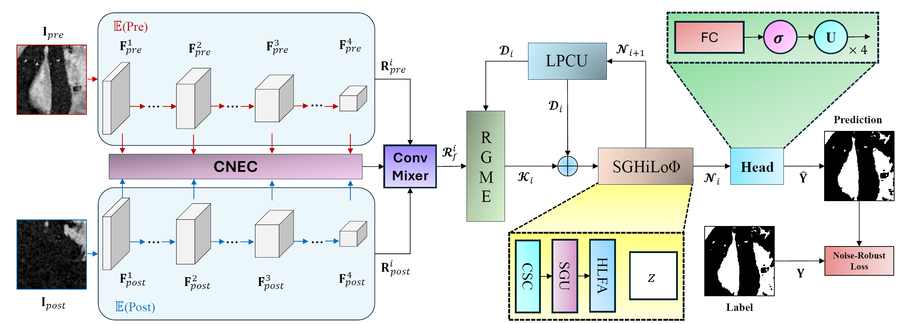
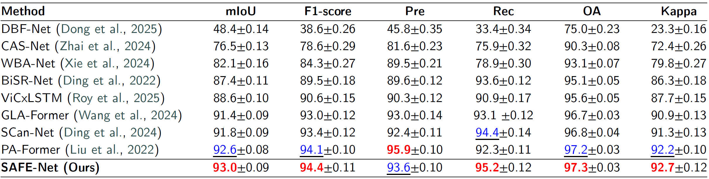
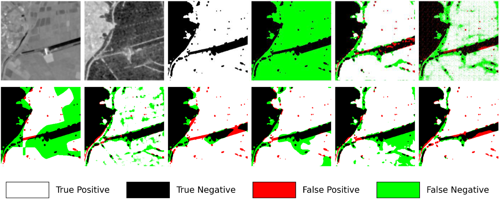
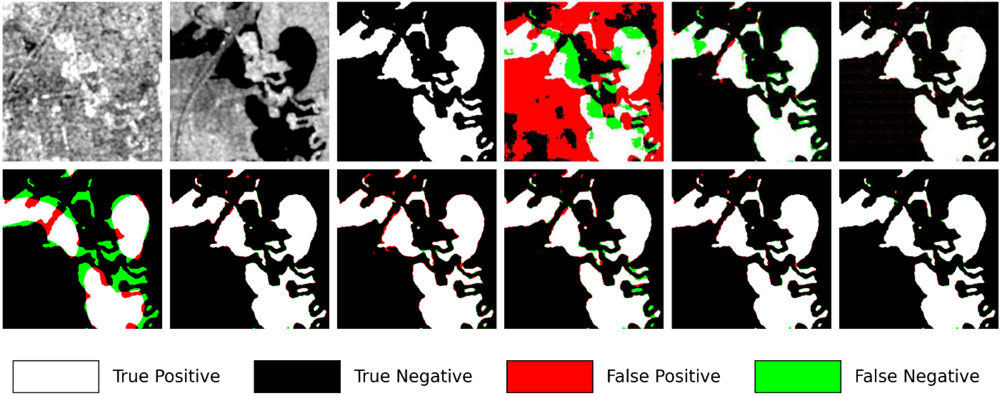
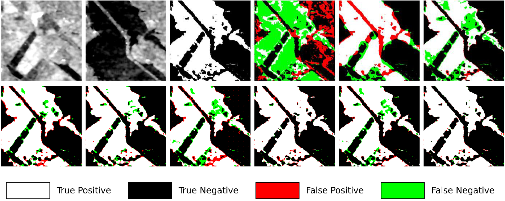

# SAFE-Net: Flood mapping from SAR imagery with a shift-attention and frequency-gated vision transformer

> [Tamer Saleh](https://scholar.google.com/citations?hl=en&user=KAmm5ZkAAAAJ&view_op=list_works&sortby=pubdate), [Gui-Song Xia](https://scholar.google.com/citations?user=SAUCVsEAAAAJ&hl=en), [Wen Yang](https://scholar.google.com/citations?user=-aVL-UQAAAAJ&hl=en), [Mohamed Ihmeida](), [Zhuohong Li](), [Shimaa Holail](https://scholar.google.com/citations?user=WKKVqDgAAAAJ&hl=en)

## Requirements

Before using this repository, make sure you have the following prerequisites installed:

- [Anaconda](https://www.anaconda.com/download/)
- [PyTorch](https://pytorch.org)

> torch==2.6.0
  torchaudio==2.6.0
  torchvision==0.21.0

Tested using Python 3.9.0 on a 64-bit Windows operating system.
```bash
conda install pytorch torchvision pytorch-cuda=12.4 -c pytorch -c nvidia
```

### Installation

To get started, create the [conda](https://docs.conda.io/projects/conda/en/stable/) environment named `SAFE-FD` by executing the following command:
```bash
conda create -n SAFE_FD python=3.9.0 -y
```

Then activate the environment:
```bash
conda activate SAFE_FD
```

Download the datasets and place them in the `Benchmark` folder.

## Supported Datasets

Dataset | Name | Link
:-:|:-:|:-:
Ombria-Net | `OmbriaS1` | [source](https://ieeexplore.ieee.org/document/9723593)
DAM-Net | `S1GFloods` | [source](https://www.sciencedirect.com/science/article/pii/S0924271624002168)
New-Dataset | `S1GFloods+7` | [baidu drive](https://pan.baidu.com/s/1SkFGxfFIf7nDIIbDI4Zlrg?pwd=i8tm) Passward: (i8tm)


### :point_right: Data Structure

```yaml
For S1GFloods+7 dataset, please respect the following structure: 
├————train/
|├———A/                                  Images of Time 1 before the flood event
  ├———image_001.png
   ...
  ├———image_3622.png
|├———B/                                 Images of Time 2 after the flood event
  ├———image_001.png
   ...
  ├———image_3622.png           
|├———GT/                                   Ground truth labels
  ├———image_001.png
   ...
  ├———image_3622.png 
```


## 1. Method


> We propose a shifted attention frequency-gated network (SAFE-Net) for flood detection from bi-temporal SAR image pairs.


### 🔭 Supported SOTA <a name="baselines"></a>

Method | Name | Link
:-:|:-:|:-:
:open_book:	:open_book:	 :open_book: DBF-Net | `DBF-Net` | [[paper here](https://ieeexplore.ieee.org/document/10848167)]
:open_book:	:open_book:	 :open_book: WBA-Net | `WBA-Net` | [paper here](https://ieeexplore.ieee.org/document/10605827)
:open_book:	:open_book:	 :open_book: GLA-Former | `GLA-Former` | [paper here](https://ieeexplore.ieee.org/document/10766648)
:open_book:	:open_book:	 :open_book: CAS-Net | `CAS-Net` | [paper here ](https://ieeexplore.ieee.org/document/10504920)
:open_book:	:open_book:	 :open_book: PA-Former | `PA-Former` | [paper here](https://ieeexplore.ieee.org/document/9863867)
:open_book:	:open_book:	 :open_book: ViCxLSTM | `ViCxLSTM` | [paper here](https://www.sciencedirect.com/science/article/pii/S1569843225004480)
:open_book:	:open_book:	 :open_book: BiSR-Net | `BiSR-Net` | [paper here](https://ieeexplore.ieee.org/document/9721305)
:open_book:	:open_book:	 :open_book: SCan-Net | `SCan-Net` | [paper here](https://ieeexplore.ieee.org/document/10443352)


## Results
### Quantitative


> Quantitative comparison of flood detection results on the S1GFloods+7 test dataset. The best value for each evaluation metric is highlighted in bold red, while the second-best value is underlined in blue. Each metric is reported as the mean (%) ± standard deviation (per-image average).


### Qualitative
- OmbriaS1

    

    > Qualitative comparison on the OmbriaS1 dataset. From left to right: T1 image, T2 image, Ground Truth, DBF-Net, CAS-Net, WBA-Net, GLA-Former, BiSR-Net, ViCxLSTM, PA-Former, SCan-Net, and the proposed SAFE-Net method (Ours).

- S1GFloods

    

    > Qualitative comparison on the S1GFloods dataset. From left to right: T1 image, T2 image, Ground Truth, DBF-Net, CAS-Net, WBA-Net, GLA-Former, BiSR-Net, ViCxLSTM, PA-Former, SCan-Net, and the proposed SAFE-Net method (Ours).

- S1GFloods+7

    

    > Qualitative comparison on the S1GFloods+7 dataset. From left to right: T1 image, T2 image, Ground Truth, DBF-Net, CAS-Net, WBA-Net, BiSR-Net, ViCxLSTM, GLA-Former, SCan-Net, PA-Former, and the proposed SAFE-Net method (Ours).


### :page_with_curl: Citation <a name="citing"></a>

```bibtex
@ARTICLE{tasaleh2026SAFENet,
  Author = {Tamer Saleh, Gui-Song Xia, Wen Yang, Mohamed Ihmeida, Zhuohong Li, Shimaa Holail},
  Title = {SAFE-Net: Flood mapping from SAR imagery with a shift-attention and frequency-gated vision transformer},
  Journal = {ISPRS Journal of Photogrammetry and Remote Sensing},
  Year = {2026},
  volume={},
  number={},
  pages={1-24},
  doi = {},
  }
```

## License
The code and datasets are released for non-commercial and research purposes only.

## Related resources
- [ASF-Dataset](https://search.asf.alaska.edu/)
- [SNAP Toolbox](http://step.esa.int/main/download/)
